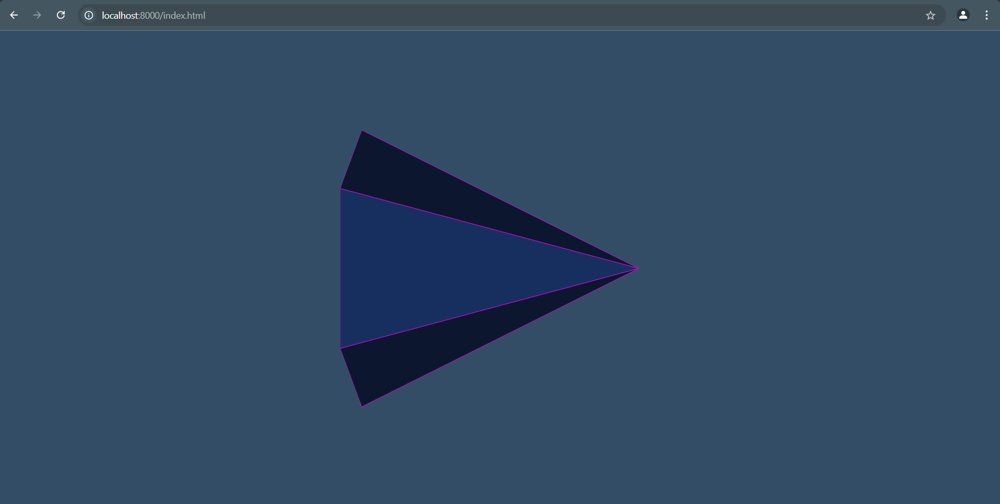

Bu proje, Visualization Toolkit (VTK) kütüphanesinin WebAssembly (WASM) olarak derlenip bir tarayıcıda çalıştırılmasını sağlayan bir test projesidir. Projede kullanılan bağımlılıklar Conan ile yönetilir ve Emscripten tarafından derleme yapılır.

Klasör Yapısı
-conanfile.py: Projenin Conan bağımlılıklarını yöneten dosya.
-build.bat: Build işlemlerini otomatikleştiren Windows komut dosyası.
-CMakeLists.txt: CMake yapılandırma dosyası.
-main.cpp: Proje için ana C++ kodu.
-index.html: WASM modülü için kullanılan HTML dosyası.


Gereksinimler
Bu projeyi çalıştırmadan önce aşağıdaki araçların bilgisayarınızda kurulu olması gerekmektedir:

*Conan (>=2.0)
*Python (>=3.7)
*Bir tarayıcı (örneğin, Chrome veya Firefox)

Nasıl Çalıştırılır?

Adımlar:
1.Depoyu Klonlayın
``` bash
git clone https://github.com/yarenakin/Vtk-Wasm-Conan2-Test.git
cd Vtk-Wasm-Conan2-Test
```
2.Build Script'i Çalıştırın Windows üzerindeyseniz, build.bat dosyasını çalıştırarak tüm işlemleri otomatik olarak gerçekleştirebilirsiniz:
``` bash
./build.bat
```
3.Yerel HTTP Sunucusunu Çalıştırın Build işlemi tamamlandıktan sonra bir Python HTTP sunucusu otomatik olarak çalıştırılır. Eğer manuel çalıştırmanız gerekirse:
``` bash
cd build
python -m http.server
```

4.Projeyi Web Tarayıcısında Çalıştırın. Python sunucusu çalıştıktan sonra tarayıcınızı açın ve şu URL'yi ziyaret edin:
-->   http://localhost:8000

5.Sorun Giderme
5.1.Profil Eksikse
  Eğer emscripten_profile adlı Conan profili bulunamazsa, build.bat otomatik olarak oluşturur.
5.2.Bağımlılıklar Yüklenmiyor
  Bağımlılıkların yüklenmediğinden şüpheleniyorsanız, şu komutu manuel olarak çalıştırabilirsiniz:
``` bash
conan install . --profile=emscripten_profile --build=missing
```

Eğer her şey doğru bir şekilde kurulduysa, VTK ile WASM çıktısını tarayıcınızda görmelisiniz:


